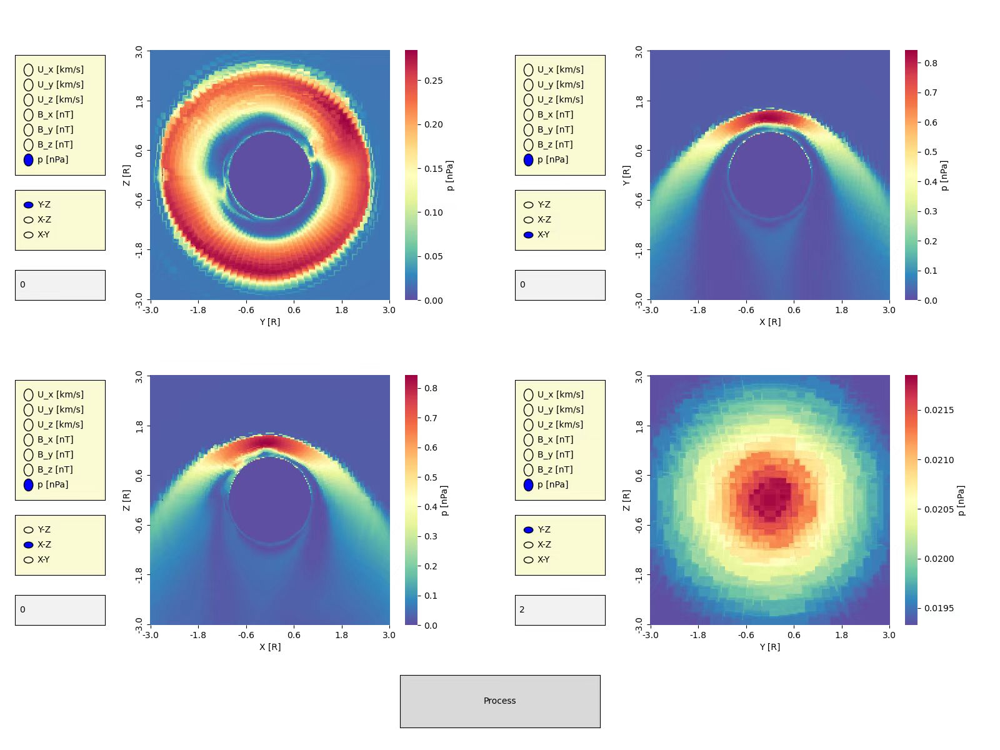

# Parallel Data Visualization Software

The data visualization project involves converting physical data defined by a huge (7 million) set of polygon meshes to 2D heat maps efficiently. Using the graphical interface my teammates and I have constructed, researchers can test their hypothesis on the large data set with precision and speed. 

